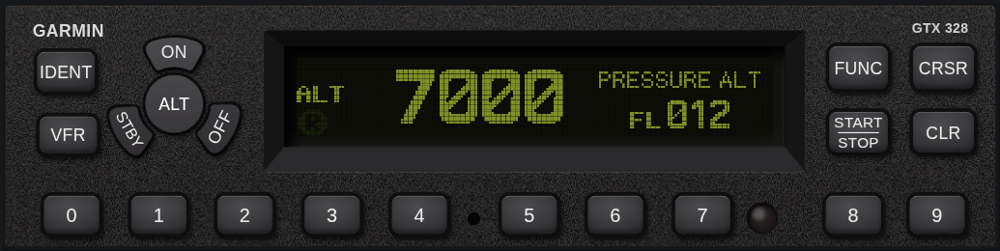
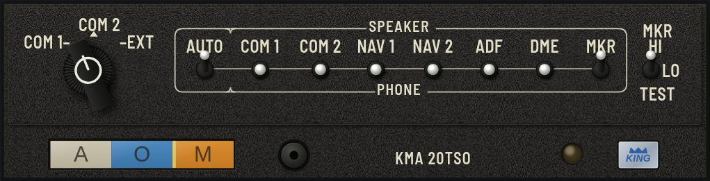
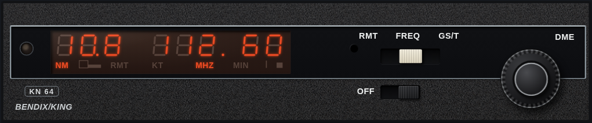

# RadioRack

Avionics simulators for practice outside the cockpit.

Every unit here behaves the way its manual says it does: the same keys, the same knob pushes, the same menus, the same screens. You turn knobs with the mouse, hear the radio, and work through the real procedures until your fingers know them.

## The units

### Garmin GTR 225A — VHF COM


8.33 kHz COM with monitor, intercom, timers, the frequency database (nearest airports, ATIS, FIS), user frequencies, stuck-mic and emergency 121.5. Built from the [Pilot's Guide 190-01182-00 Rev D](https://static.garmin.com/pumac/190-01182-00_d.pdf).

### Garmin GNC 255A — NAV/COM


Everything the GTR does, plus the NAV side: VOR/LOC tuning, OBS and CDI, TO/FROM, distance, and Morse ident. A simple flight simulation moves the aircraft along a track. Built from the [Pilot's Guide 190-01182-01 Rev E](https://static.garmin.com/pumac/190-01182-01_e.pdf).

### Trig TT31 — Mode S transponder


Mode knob, squawk and Flight ID entry, IDENT, the VFR conspicuity code, flight timer, stopwatch, altitude monitor and the ADS-B position warning. Built from the [Operating Manual 00454-00-AF](https://trig-avionics.com/library/00454-00%20AF%20TT31%20Operating%20Handbook.pdf) and [Installation Manual 00455-00-AR](https://trig-avionics.com/library/00455-00%20AR%20TT31%20Installation%20Manual%20-%20Full.pdf).

### Garmin GTX 328 — Mode S transponder



The mode keys, squawk entry with dashes and the cursor, IDENT, VFR, pressure altitude with the trend arrow, flight time, altitude monitor with "Leaving Altitude", count up and count down timers, Flight ID entry at power-up and all the installer configuration pages. Built from the [Pilot's Guide 190-00420-03](https://static.garmin.com/pumac/GTX328Transponder_PilotsGuide.pdf), the [Installation Manual 190-00420-04](https://www.scribd.com/document/690272720/60004460-GTX328-InstallationManual) (not published by Garmin) and the [Maintenance Manual 190-00420-05](https://static.garmin.com/pumac/GTX328Transponder_MaintenanceManual.pdf).

### Becker AR6201 — 57 mm VHF COM


Standard, Direct Tune and Channel modes, scan with priority, 99 labeled user channels and the last-channel memory, squelch with signal strength, intercom and pilot menus — and the full installer Installation Setup behind the password. Built from the [Operating Instructions (Issue 5, 2013)](https://www.becker-avionics.com/wp-content/uploads/2017/08/AR6201_OI.pdf) and the [Installation and Operation Manual DV 14300.03](https://www.becker-avionics.com/wp-content/uploads/2017/08/AR6201_IO_SW3050149.pdf).

### King KMA 20 TSO — audio panel with marker beacon receiver



The microphone selector, a SPEAKER / OFF / PHONE toggle for every receiver, the AUTO switch that follows the transmitter you talk on, mic muting, and the marker lamps and tones (HI / LO / TEST) while you fly a real Czech ILS approach with outer and middle markers. Every input plays a real signal: COM calls and the Morse idents of the tuned VOR, ILS, NDB and DME. Built from the King brochure "Operating your KMA 20 Audio Control System" (006-8200-05; the public copy is [another edition](https://www.wpaviation.com/pdfs/king_kma20_pilot_guide.pdf)) and the [KMA 20/KR 21 Installation Manual (006-0044-02 Rev 2)](https://www.csobeech.com/files/KMA20-Manual.pdf).

### Bendix/King KN 64 — DME



The RMT / FREQ / GS/T function switch, the concentric knobs with the pull-out 0.05 MHz, the frequency hold in GS/T, dashes while searching, and slant range, ground speed and time-to-station on the gas discharge display while you fly toward real Czech DMEs (ENR 4.1 and the ILS DMEs of AD 2.19, at their published antenna elevation). Built from the [Bendix/King Silver Crown Plus Pilot's Guide](http://www.heilmannpub.com/kingpilotguides.pdf) (KN 62A and KN 64) and the [KN 62/62A/64 Installation Manual (006-00144-0007 Rev 7)](http://www.flymafc.com/docs/manuals/king-KN62_KN62A_KN64.pdf).

## Running it

You need Python 3 and a browser.

```sh
python3 sim/serve.py
```

Open <http://localhost:8225> and pick a unit.

## How to use a simulator

- **Turn a knob:** drag it up or down, or scroll over it.
- **Push a knob:** click it. On the KN 64 a click pulls the small knob out or pushes it in.
- **Move a slide switch:** drag it sideways, click where you want it, or scroll over it (KN 64).
- **Press a key:** click it. Hold it for a long press where the unit has one.
- **Keep a key pressed:** right-click it (GTX 328), click again to release.
- **Flip a toggle switch:** click its upper or lower half, or scroll over it (KMA 20). On a touch screen, swipe it up or down, or tap a half.
- **Hover anything** for a tooltip that says what it does.

Under each unit there are panels for the things that happen *outside* the radio: the cockpit light on the photocell, hold PTT, make a station call you on the active or standby frequency, switch off the avionics master, set the GPS position, fly a track or an ILS approach, set the altitude, tune the NAV receiver that channels the DME, tune the receivers behind the audio panel, put the headset on, raise a fault. On the right there's a cheat sheet of the procedures from the manual, and the manuals themselves are one click away.

The web pages come in English, Ukrainian, Czech and Slovak: pick a language with the flag in the top bar (the first visit follows your browser's language). The units themselves stay in English, exactly as their displays and labels read in the cockpit.

Settings, frequencies, stored channels and the language are kept in your browser.

## How faithful is it?

The manual is the spec. Procedures are implemented step by step as written, and every one of them is replayed as an automated test. Nothing appears on a screen unless it's in a manual figure or a photo of the real unit.

Where a manual is silent — how long a splash screen stays up, what a key does on a page the manual never mentions — the simulator makes a minimal, sensible choice and writes it down in [ASSUMPTIONS.md](ASSUMPTIONS.md), with a checkbox to tick once someone checks it on a real unit.

Frequencies and navaids come from the Czech AIP (aim.rlp.cz) for a specific AIRAC cycle; the cycle is noted in `sim/data/lk.js`.

## Tests

```sh
npm ci          # once: installs the linter (Biome)
npm run lint
npm test
```

Unit tests plus a manual-replay suite per device: every numbered procedure from the manuals, pressed key by key on a unit that's already been used for something else.

## Deploying

The site is plain static files, served by Cloudflare (Workers static assets) at <https://radiorack.dr1v3.cz>. GitHub Actions (`.github/workflows/ci.yml`) lints and tests every push and pull request that touches the site, and deploys `master` with `wrangler deploy` (config in `wrangler.jsonc`). Changes that only touch Markdown, `.claude/` or the PDFs in the repo root don't run it. Run it by hand from the Actions tab (Run workflow).

One-time setup in the GitHub repo settings:

- Secret `CLOUDFLARE_API_TOKEN`: a Cloudflare API token from the "Edit Cloudflare Workers" template. It needs no DNS permissions.
- Secret `CLOUDFLARE_ACCOUNT_ID`: the account ID from the Cloudflare dashboard.
- After the first deploy, attach the domain once in the Cloudflare dashboard: Workers & Pages → `radiorack` → Settings → Domains & Routes → Add → Custom domain → `radiorack.dr1v3.cz`. Cloudflare creates the DNS record and the certificate.
- Optional variable `SELF_HOST_MANUALS`: unset, the deployed manual buttons open each manual's public source (`sim/data/manuals.js`) and the PDFs aren't uploaded. Set it to `true` to serve the PDFs from `sim/manuals/` instead. Locally they're always served from `sim/manuals/` (`sim/config.js`).

## Adding a unit

There's a Claude Code skill for it in [`.claude/skills/add-device/`](.claude/skills/add-device/SKILL.md): how to read the manuals, what to look for in the installation manual, which shared code to reuse, how to make the bezel look right, and how to check the result against photos. The code layout is described in [CLAUDE.md](CLAUDE.md).

## Credits

The manuals in `sim/manuals/` belong to Garmin, Trig Avionics, Becker Avionics and Honeywell (Bendix/King) and are included for reference; `sim/data/manuals.js` lists where each one was downloaded from. The bundled fonts — Jersey 15, Barlow Semi Condensed and Nunito — are under the SIL Open Font License (see `sim/fonts/`). The flags in `sim/flags/` are from [flag-icons](https://github.com/lipis/flag-icons) (MIT), with the official colors.
