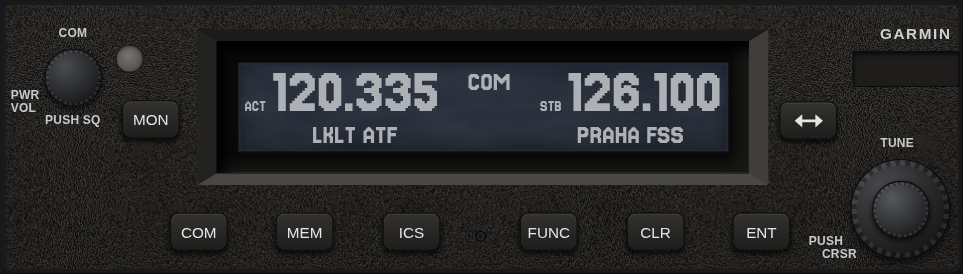
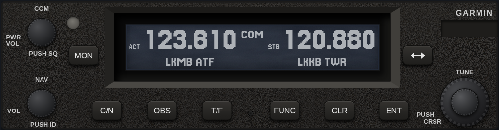
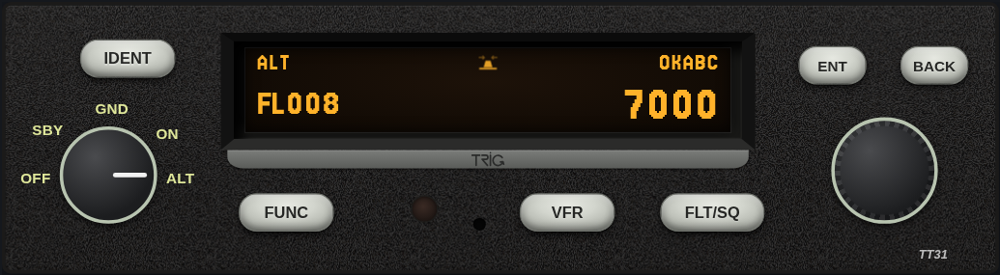
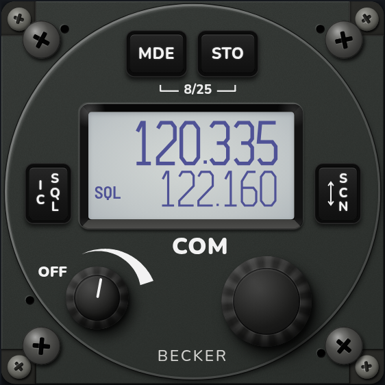

# RadioRack

Avionics simulators you can practise on before you get in the aircraft.

Every unit here behaves the way its manual says it does: the same keys, the same knob pushes, the same menus, the same screens. You turn knobs with the mouse, hear the radio, and work through the real procedures until your fingers know them. No headset, no master switch, no Hobbs time.

## The units

### Garmin GTR 225A — VHF COM



8.33 kHz COM with monitor, intercom, timers, the frequency database (nearest airports, ATIS, FIS), user frequencies, stuck-mic and emergency 121.5. Built from the Pilot's Guide 190-01182-00 Rev D.

### Garmin GNC 255A — NAV/COM



Everything the GTR does, plus the NAV side: VOR/LOC tuning, OBS and CDI, TO/FROM, distance, and Morse ident you can actually listen to. A small flight simulation moves you across the map so the needle has something to do. Built from the Pilot's Guide 190-01182-01 Rev E.

### Trig TT31 — Mode S transponder



Mode knob, squawk and Flight ID entry, IDENT, the VFR conspicuity code, flight timer, stopwatch, altitude monitor and the ADS-B position warning. The screens are copied from photos of a real unit. Built from the Operating Manual 00454-00-AF and Installation Manual 00455-00-AR.

### Becker AR6201 — 57 mm VHF COM



Standard, Direct Tune and Channel modes, scan with priority, 99 labelled user channels and the last-channel memory, squelch with signal strength, intercom and pilot menus — and the full installer Installation Setup behind the password. Built from the Operating Instructions (Issue 5, 2013) and the Installation and Operation Manual DV 14300.03.

## Running it

You need Python 3 and a browser. That's it — no build, no npm install.

```sh
python3 sim/serve.py
```

Open <http://localhost:8225> and pick a unit.

(It has to be served over HTTP; opening the HTML file directly won't load the modules.)

## How to use a simulator

- **Turn a knob:** drag it up or down, or scroll over it.
- **Push a knob:** click it.
- **Press a key:** click it. Hold it for a long press where the unit has one.
- **Hover anything** for a tooltip that says what it does.

Under each unit there are panels for the things that happen *outside* the radio: hold PTT, make a station call you on the active or standby frequency, pull aircraft power, set the GPS position, fly a track, raise a fault. On the right there's a cheat sheet of the procedures from the manual, and the manuals themselves are one click away.

Settings, frequencies and stored channels are kept in your browser, just like the unit would keep them.

## How faithful is it?

As faithful as the paperwork allows. The rule is simple: the manual is the spec. Procedures are implemented step by step as written, and every one of them is replayed as an automated test. Nothing appears on a screen unless it's in a manual figure or a photo of the real unit.

Where a manual is silent — how long a splash screen stays up, what a key does on a page the manual never mentions — the simulator makes a minimal, sensible choice and writes it down in [ASSUMPTIONS.md](ASSUMPTIONS.md), with a checkbox to tick once someone checks it on a real unit. If you have access to one of these units, that file is the most useful thing you can help with.

Frequencies and navaids come from the Czech AIP (aim.rlp.cz) for a specific AIRAC cycle, so they're real but they age. The cycle is noted in `sim/data/lk.js`.

## Tests

```sh
cd sim && node --test
```

Unit tests plus a manual-replay suite per device: every numbered procedure from the manuals, pressed key by key on a unit that's already been used for something else.

## Adding a unit

There's a Claude Code skill for it in [`.claude/skills/add-device/`](.claude/skills/add-device/SKILL.md): how to read the manuals, what to look for in the installation manual, which shared code to reuse, how to make the bezel look right, and how to check the result against photos. The code layout is described in [CLAUDE.md](CLAUDE.md).

## Credits

The manuals in `sim/manuals/` belong to Garmin, Trig Avionics and Becker Avionics and are included for reference. The bundled fonts — Jersey 15, Barlow Semi Condensed and Nunito — are under the SIL Open Font License (see `sim/fonts/`).
